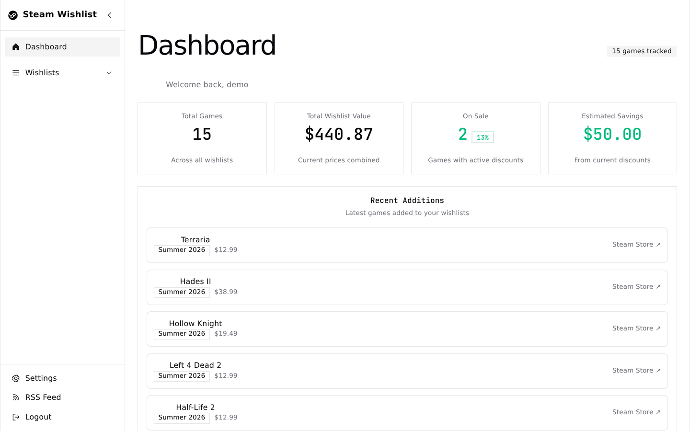
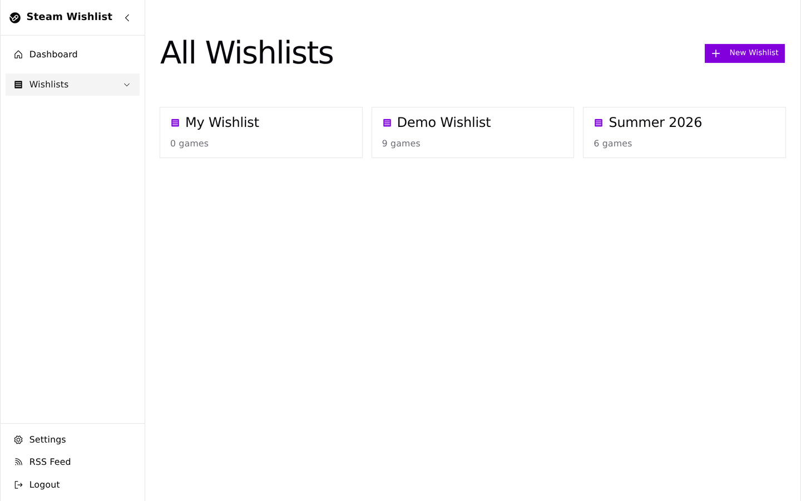
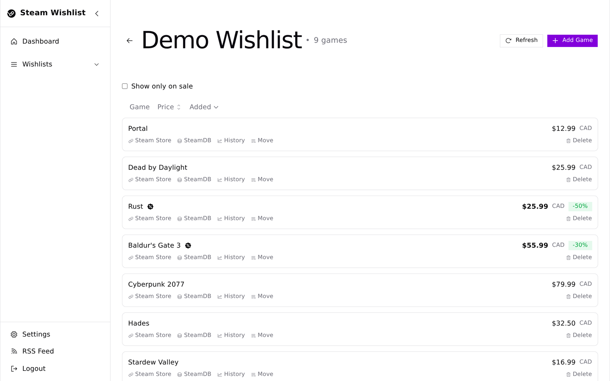
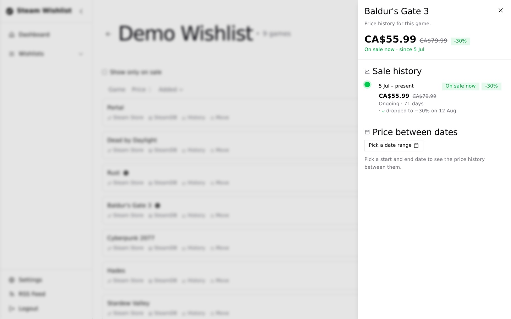
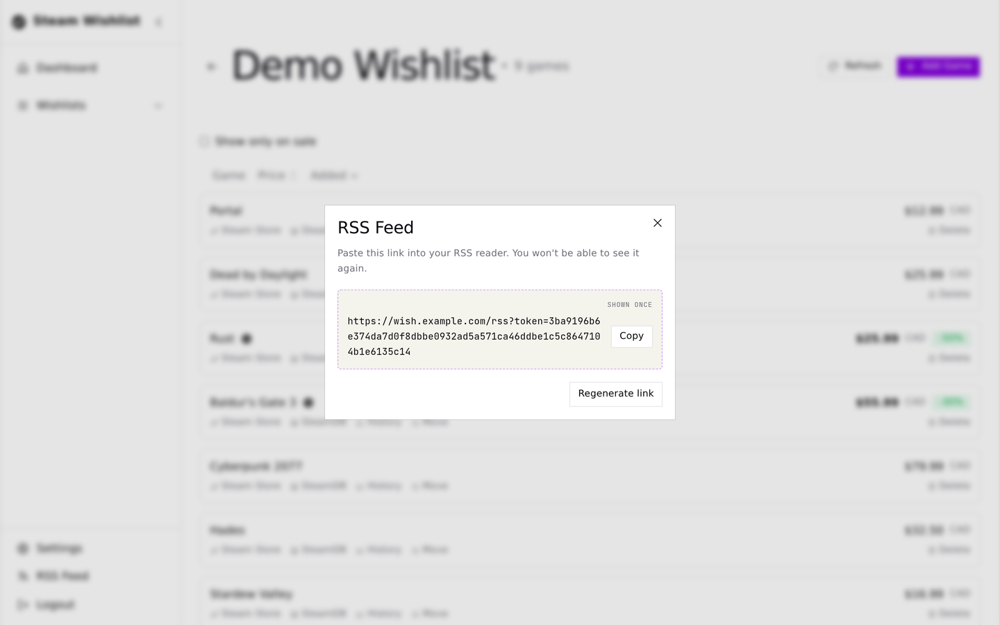
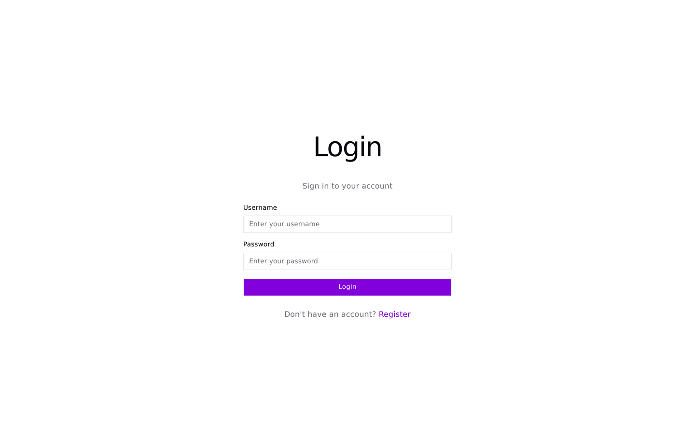

# Steam Wishlist

A personal Steam wishlist tracker.

| | |
| --- | --- |
|  |  |
|  |  |
|  |  |

## Features

- **Multiple wishlists** per account — create, rename, move games between them
- **Price tracking** against the Steam Store API, refreshed daily on a schedule
- **Price & sale history** per game — browse past prices and sale periods
- **RSS feed** of price drops across all your wishlists (private, token-based link shown once)
- **Steam wishlist import** — pull in your public Steam wishlist via your Steam ID64, with daily automatic re-sync
- **Dashboard stats** — total games, combined wishlist value, games on sale, estimated savings

## Tech stack

- **Frontend:** React 19, Vite, TypeScript, Tailwind CSS, shadcn/ui, Redux Toolkit
- **Backend:** Node.js, Express, TypeScript, Prisma, SQLite
- **Deployment:** single multi-stage Docker image (serves the built frontend + API)

## Getting started (development)

Requires Node 24+.

```bash
cp example.env .env   # then set a real JWT_SECRET
cd backend && npm install && npm run dev   # API on http://localhost:4000
cd frontend && npm install && npm run dev  # UI on http://localhost:5173
```

Run `npx prisma migrate deploy` in `backend/` on a fresh database.

## Docker

```bash
docker compose up --build
```

Serves on port 4001 (mapped to 4000 in the container); the SQLite database persists in `./data/`.

## Configuration

See [example.env](example.env) for all options — store region, refresh/sync schedules, JWT settings, and `APP_URL` (used to build the RSS feed link).

## AI disclosure

This app was written with AI, mostly Qwen 3.6 27B and Qwen 3.8 27B.

## License

[MIT](LICENSE)
