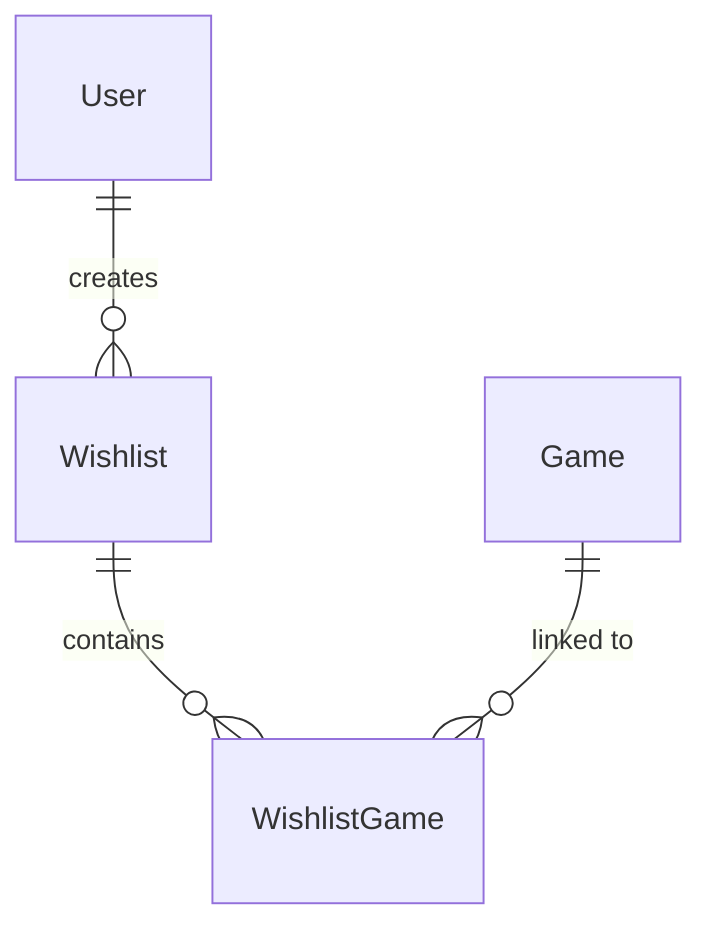

# Steam Wishlist App - Planning Document V2

> Updated to reflect actual implementation state and architectural decisions.
> Original planning document preserved as [`PLANNING.md`](PLANNING.md:1).

## 1. Project Overview

A private, self-hosted Steam wishlist management web application that allows 1-3 users to track their Steam game wishlists, prices, and discounts using Steam's Store API.

### Core Goals
- Simple, private wishlist management separate from Steam's native system
- Support multi-user accounts (1-3 users) with secure login
- **Each user can create and manage multiple named wishlists (e.g., "Must Haves", "On Sale Watch", "Co-op Games")**
- Query real-time game data (price, discounts, release info) from Steam API
- **RSS feed for price drop/sale notifications (user-subscribes via their RSS reader)**
- Self-contained Docker deployment
- Clean, modern UI with shadcn/ui and Tailwind CSS

### Design Philosophy
- **Minimalist scope:** Track wishlists and prices; link to Steam for full game details
- **No game detail pages:** Users navigate to Steam Store directly for descriptions, screenshots, etc.
- **Cached price data only:** The `Game` model exists solely for price tracking, not catalog mirroring

---

## 2. Technology Stack

### Backend
- **Runtime:** Node.js (LTS)
- **Framework:** Express.js
- **Language:** TypeScript (ES modules, `module: "NodeNext"`)
- **ORM:** Prisma 7.x
- **Database:** SQLite (via LibSQL adapter)
- **Auth:** bcryptjs for password hashing, JWT for session management
- **HTTP Client:** native `fetch` for Steam API calls
- **Scheduling:** node-schedule for price refresh jobs
- **Queue:** Custom job queue for Steam API rate limiting
- **RSS Feed:** `rss` or `feed` library for generating notification feeds

### Frontend
- **Framework:** React 19
- **Language:** TypeScript ~6.0
- **State Management:** Redux Toolkit + RTK Query (using `fetchBaseQuery`)
- **Routing:** React Router v7
- **UI Components:** shadcn/ui (base-lyra style, phosphor icons)
- **Styling:** Tailwind CSS v4
- **Build Tool:** Vite 8

### Infrastructure
- **Containerization:** Docker + Docker Compose (single service)
- **Database:** SQLite via Prisma migrations

---

## 3. Docker Architecture

```
services:
  - app: Express + Node.js backend + frontend (single container)
```

### Data Persistence
- SQLite database file mounted as a volume (`./data:/app/data`)
- Prisma schema and migrations in `backend/prisma`

### Production Mode
- Single container serves both backend API and built frontend static files
- Frontend build included in Dockerfile
- SPA fallback routes configured in Express

---

## 4. Database Schema (Prisma)

> **Key Evolution from V1:** Introduced a separate `Game` model to centralize cached game data. `WishlistGame` is now a join table for wishlist membership and user metadata.

### Models

#### User
- `id`: String (UUID)
- `username`: String (unique)
- `passwordHash`: String
- `steamId`: String? (optional, for future Steam profile linking)
- `wishlists`: Wishlist[]
- `createdAt`: DateTime
- `updatedAt`: DateTime

#### Wishlist
- `id`: String (UUID)
- `userId`: String (FK -> User)
- `user`: User (relation, onDelete: Cascade)
- `name`: String
- `description`: String?
- `isDefault`: Boolean (default: false)
- `games`: WishlistGame[]
- `createdAt`: DateTime
- `updatedAt`: DateTime

#### Game (New)
- `steamId`: Int (primary key, Steam AppID)
- `name`: String (cached from Steam API)
- `currentPrice`: Decimal? (cached)
- `originalPrice`: Decimal? (cached, for discounts)
- `discountPercent`: Int? (cached)
- `currency`: String (default: "USD")
- `imageUrl`: String? (cached small capsule image)
- `priceUpdatedAt`: DateTime?
- `wishlistGames`: WishlistGame[]
- `createdAt`: DateTime
- `updatedAt`: DateTime

#### WishlistGame
- `gameId`: Int (FK -> Game.steamId)
- `wishlistId`: String (FK -> Wishlist)
- `game`: Game (relation, onDelete: Cascade)
- `wishlist`: Wishlist (relation, onDelete: Cascade)
- `addedAt`: DateTime
- `notes`: String? (reserved for future use)
- `rank`: Int (default: 0, reserved for future use)
- **Composite primary key:** `@@id([gameId, wishlistId])`

### Relations


### Benefits of New Schema
- Single source of truth for game price data across all wishlists
- Efficient price updates (update one `Game` row instead of duplicates)
- Supports multiple users tracking the same game independently
- Clean separation between game metadata (Steam-sourced) and wishlist membership (user-sourced)

---

## 5. API Endpoints

### Authentication

| Method | Path | Description | Status |
|--------|------|-------------|--------|
| POST | `/api/auth/register` | Create new user (username/password) | Implemented |
| POST | `/api/auth/login` | Authenticate and receive JWT | Implemented |
| GET | `/api/auth/profile` | Get current user profile (protected) | Implemented |
| POST | `/api/auth/logout` | Client-side token removal only | N/A (client-side) |

### Notifications

| Method | Path | Description | Status |
|--------|------|-------------|--------|
| GET | `/api/rss/notifications/{userId}` | RSS feed of price changes for user (authenticated via query token) | Planned |

### Wishlists

| Method | Path | Description | Status |
|--------|------|-------------|--------|
| GET | `/api/wishlists` | List all wishlists for current user | Implemented |
| GET | `/api/wishlists/all-games` | All games across all user wishlists (dashboard) | Implemented |
| POST | `/api/wishlists` | Create a new wishlist | Implemented |
| GET | `/api/wishlists/:wishlistId` | Get single wishlist with games | Implemented |
| PUT | `/api/wishlists/:wishlistId` | Update wishlist name/description | Implemented |
| DELETE | `/api/wishlists/:wishlistId` | Delete wishlist and all games | Implemented |

### Games

| Method | Path | Description | Status |
|--------|------|-------------|--------|
| GET | `/api/wishlists/:wishlistId/games` | List games in a wishlist | Implemented |
| POST | `/api/wishlists/:wishlistId/games` | Add a game to a wishlist by Steam AppID | Implemented |
| POST | `/api/wishlists/:wishlistId/games/refresh` | Refresh prices for all games in a wishlist | Implemented |
| DELETE | `/api/games/:gameId` | Remove from wishlist (gameId format: `steamId+wishlistId`) | Implemented |
| POST | `/api/games/:gameId/move` | Move game to a different wishlist | Implemented |

### Dropped Endpoints (Intentional)

| Method | Path | Reason |
|--------|------|--------|
| GET | `/api/games/:gameId` | Dropped - no standalone game detail pages needed |
| PUT | `/api/games/:gameId` | Dropped - notes feature not implemented |
| GET | `/api/admin/users` | Dropped - admin functionality not needed for 1-3 user app |
| DELETE | `/api/admin/users/:id` | Dropped - admin functionality not needed |

---

## 6. Steam API Integration

### APIs Used

#### Store API (Public, No Key Required)
- Endpoint: `https://store.steampowered.com/api/appdetails`
- Use: Fetch game details (name, price, discounts, image)
- Call: `GET https://store.steampowered.com/api/appdetails?appids={appid}&cc={cc}`
- Rate limiting handled via [`steamQueue`](backend/src/lib/steamQueue.ts:1)

### External Links
- Steam Store: `https://store.steampowered.com/app/{appid}/`
- SteamDB price history: `https://steamdb.info/app/{appid}/history/`

### Price Refresh
- Scheduled daily refresh via [`price-refresh-job.ts`](backend/src/services/price-refresh-job.ts:1)
- Configurable time via `PRICE_REFRESH_HOUR`, `PRICE_REFRESH_MINUTE`, `PRICE_REFRESH_TIMEZONE` env vars
- Manual refresh endpoint available per wishlist
- RSS feed automatically updated with price changes after each refresh

---

## 7. Frontend Architecture

### Pages

1. **Login Page** - Username/password login form
2. **Register Page** - Create account form
3. **Dashboard** - Overview: game count, total wishlist value, active discounts, recent adds
4. **Wishlists Page** - Lists all user's wishlists with game counts; allows creating/editing/deleting wishlists
5. **Wishlist Games Page** - Table/Grid of games in a selected wishlist:
   - Name, image, current price, discount badge
   - Sort by: name, price, discount %, date added
   - Filter by: on sale / not on sale
   - Actions: Steam Store link, SteamDB link, remove, move to another wishlist
6. **Add Game Dialog** - Modal dialog (on Wishlist Games Page) to enter a Steam AppID or Steam store URL

### State Management (Redux Toolkit)
- **app/services/api.ts** - Central `createApi()` with shared `fetchBaseQuery` configuration (base URL, token injection, tag types). No endpoints defined here.
- **app/services/*.ts** - Domain-specific API modules (authApi, wishlistApi) using `injectEndpoints()` on the central API instance.
- **features/auth/authSlice.ts** - Dedicated slice for authentication state (user, status, error). Uses `extraReducers` with `addMatcher()` on RTK Query endpoints to keep auth-related UI state in sync with API operations.

**RTK Query + authSlice Pattern:** RTK Query manages cached API data via generated hooks. The `authSlice` stores derived/auth-related state:
- Current user object (persisted across navigation)
- Authentication status (idle/loading/succeeded/failed)
- Error messages for login failures

### Key UI Components (shadcn/ui)
- Layout: Collapsible sidebar layout ([`AppLayout`](frontend/src/components/Layout/AppLayout.tsx:18)) + responsive mobile drawer (`Sheet`)
- Forms: Controlled inputs with `useState` + shadcn/ui `Input`, `Button`, `Select`, `Label`
- Tables: shadcn/ui `Table`
- Cards: shadcn/ui `Card`
- Modals: shadcn/ui `Dialog`
- Notifications: shadcn/ui `Toast`
- Navigation: shadcn/ui `Sheet` (mobile menu), `DropdownMenu` (collapsed sidebar wishlists), `Collapsible`
- Badges/Tags: shadcn/ui `Badge` for discount indicators

**Currently installed components** (`src/components/ui/`): `badge`, `button`, `card`, `collapsible`, `dialog`, `dropdown-menu`, `input`, `label`, `sheet`, `table`, `toast`

### Routing (React Router)
```
/login              -> LoginPage
/register           -> RegisterPage
/dashboard          -> DashboardPage (protected)
/wishlists          -> WishlistsPage (protected)
/wishlists/:id      -> WishlistGamesPage (protected)
```

---

## 8. Authentication Flow

1. User registers with username/password
2. Password is hashed using bcryptjs (cost factor 12)
3. On login, server validates credentials and issues JWT
4. JWT stored in localStorage (for SPA simplicity)
5. Frontend `fetchBaseQuery` `prepareHeaders` callback reads JWT from localStorage and attaches `Authorization: Bearer <token>` to all requests
6. Express middleware validates JWT on protected routes
7. Token expiry: 7 days

---

## 9. Project Structure

```
/
├── docker-compose.yml
├── Dockerfile
├── documentation/
│   ├── PLANNING.md               # Original planning document
│   ├── PLANNING-V2.md            # This file (updated)
│   ├── FEATURE_GAP_ANALYSIS.md
│   └── FRONTEND_PLANNING.md
│
├── backend/
│   ├── Dockerfile
│   ├── package.json
│   ├── tsconfig.json
│   ├── prisma.config.ts
│   ├── prisma/
│   │   ├── schema.prisma
│   │   └── migrations/
│   ├── src/
│   │   ├── index.ts              # Express app entry
│   │   ├── config/
│   │   │   └── prisma.ts         # Prisma client instance
│   │   ├── lib/
│   │   │   └── steamQueue.ts     # Steam API rate limiting queue
│   │   ├── routes/
│   │   │   ├── auth.routes.ts
│   │   │   ├── wishlist.routes.ts
│   │   │   ├── game.routes.ts
│   │   │   └── rss-feed.routes.ts
│   │   ├── controllers/
│   │   │   ├── auth.controller.ts
│   │   │   ├── wishlist.controller.ts
│   │   │   └── game.controller.ts
│   │   ├── services/
│   │   │   ├── steam.service.ts  # Steam Store API calls
│   │   │   ├── user.service.ts
│   │   │   ├── wishlist.service.ts
│   │   │   ├── game.service.ts
│   │   │   ├── price-refresh-job.ts
│   │   │   └── rss-feed.service.ts
│   │   ├── middleware/
│   │   │   ├── auth.middleware.ts
│   │   │   └── error.middleware.ts
│   │   └── utils/
│   │       ├── jwt.ts
│   │       └── bcrypt.ts
│
└── frontend/
    ├── Dockerfile
    ├── package.json
    ├── tsconfig.json
    ├── vite.config.ts
    ├── components.json
    ├── index.html
    ├── public/
    └── src/
        ├── main.tsx
        ├── App.tsx
        ├── router.tsx            # React Router setup + protected route guards
        ├── app/
        │   └── services/
        │       ├── api.ts        # Central createApi() with baseQuery + tagTypes
        │       ├── authApi.ts    # injectEndpoints for auth
        │       └── wishlistApi.ts # injectEndpoints for wishlists/games
        ├── store/
        │   └── store.ts          # Redux store config
        ├── features/
        │   ├── auth/
        │   │   ├── authSlice.ts
        │   │   ├── LoginPage.tsx
        │   │   └── RegisterPage.tsx
        │   ├── wishlists/
        │   │   ├── WishlistsPage.tsx
        │   │   ├── WishlistGamesPage.tsx
        │   │   ├── WishlistGamesTable.tsx
        │   │   ├── WishlistCard.tsx
        │   │   ├── AddGameDialog.tsx
        │   │   └── MoveGameDialog.tsx
        │   └── dashboard/
        │       ├── DashboardPage.tsx
        │       └── StatCard.tsx
        ├── components/
        │   ├── ui/               # shadcn/ui components
        │   ├── Layout/
        │   │   ├── AppLayout.tsx
        │   │   ├── ProtectedRoute.tsx
        │   │   ├── WishlistSection.tsx
        │   │   └── CreateWishlistDialog.tsx
        │   └── ConfirmDialog.tsx
        └── types/
            └── user.ts
```

---

## 10. Environment Variables

### Backend
```
APP_ENV=production|development
PORT=4000
DATABASE_URL=file:/app/data/steam.db
JWT_SECRET=<strong-random-secret>
JWT_EXPIRES_IN=7d
STEAM_API_CC=US
STEAM_GAME_STALE_HOURS=3
PRICE_REFRESH_HOUR=13
PRICE_REFRESH_MINUTE=0
PRICE_REFRESH_TIMEZONE=America/New_York
```

### Frontend (Development)
```
VITE_API_URL=http://localhost:4000/api
```

> **Note:** In production, frontend is served by Express and uses relative `/api` paths (no env var needed).

---

## 11. Development Phases

### Phase 1: Foundation - COMPLETE
- [x] Docker deployment structure
- [x] Backend with Express + TypeScript + Prisma
- [x] Database schema defined and migrated
- [x] User registration and login with JWT
- [x] Frontend with Vite + React + Redux Toolkit + shadcn/ui + Tailwind CSS
- [x] Basic routing and protected route guards

### Phase 2: Core Wishlist Features - COMPLETE
- [x] Steam API integration (fetch game details by AppID)
- [x] CRUD endpoints for wishlists
- [x] CRUD endpoints for wishlist games (add by AppID/URL, remove with confirmation)
- [x] AppLayout sidebar with collapsible navigation and mobile Sheet drawer
- [x] WishlistSection component for sidebar wishlist navigation
- [x] CreateWishlistDialog integrated into sidebar
- [x] Sidebar displays wishlists with game counts via RTK Query
- [x] Frontend wishlists management page (list, create, rename, delete)
- [x] Frontend wishlist games page with table view (sorting, on-sale filter)
- [x] Add game flow (paste AppID or URL -> add via modal dialog)
- [x] Default wishlist creation on user registration
- [x] Move game between wishlists functionality
- [x] Dashboard with summary stats
- [x] Price refresh endpoints (manual + scheduled)

### Phase 3: Polish & UX - PARTIAL
- [x] Dashboard with summary stats
- [ ] Error handling and loading states polish (refresh polling endpoint)

### Phase 4: Optional Enhancements - NOT STARTED
- [ ] Steam profile integration (import existing wishlist)
- [ ] RSS feed for price drop/sale notifications

---

## 12. Key Considerations

### Security
- Passwords hashed with bcrypt (never stored plain)
- JWT with 7-day expiry
- CORS configured for frontend origin only
- Rate limiting on Steam API calls via queue

### Steam API Constraints
- Store API is public but undocumented rate limits apply
- Queue-based requests via [`steamQueue`](backend/src/lib/steamQueue.ts:1)
- Game data cached to reduce API load
- Scheduled price refresh configurable via env vars

### Scalability Notes
- Designed for 1-3 users, so SQLite is appropriate
- If scaling beyond, swap to PostgreSQL with minimal schema changes

### Data Backup
- SQLite file is single-file; easy to backup
- Mount as Docker volume for persistence

---

## 13. Implementation Notes

### Architecture Pattern
Backend follows a consistent layering pattern:
- **Controllers**: parse HTTP requests, basic input checks, call services, return responses
- **Services**: business logic, DB operations, token/password handling
- **Utils**: pure helpers (bcrypt, jwt)
- **Middleware**: cross-cutting concerns (auth, error handling)

### Prisma 7 Specifics
- Datasource `url` moved from `schema.prisma` to `prisma.config.ts`
- PrismaClient requires a driver adapter for database connections
- Using `@prisma/adapter-libsql` with config object `{ url: DATABASE_URL }`

### Module System
- Backend uses ES modules (`"type": "module"` in package.json)
- TypeScript config: `module: "NodeNext"`, `moduleResolution: "NodeNext"`, `verbatimModuleSyntax: true`
- ES module imports require explicit `.js` extensions on relative paths

### Composite Key Routing
- GameId encoding format: `steamId+wishlistId` (e.g., `1234567+abc-uuid`)
- Route handlers parse by splitting on `+` delimiter
- Required due to Prisma composite primary key on WishlistGame

### React Hooks Fix (DashboardPage)
- DashboardPage originally called `useGetGamesQuery(id)` inside `.map()` over dynamic wishlist IDs, violating the Rules of Hooks
- Fixed by adding `GET /api/wishlists/all-games` backend endpoint backed by `getAllGamesForUser()` service
- Frontend now uses a single static `useGetAllGamesQuery()` hook call at the top level

### Known Minor Gaps
- `refreshGames` mutation lacks RTK Query `invalidatesTags` (tracked in GitHub issue)
- `notes` and `rank` fields exist in DB but are not exposed via API/UI
- Types are inline in `wishlistApi.ts` instead of dedicated type files
