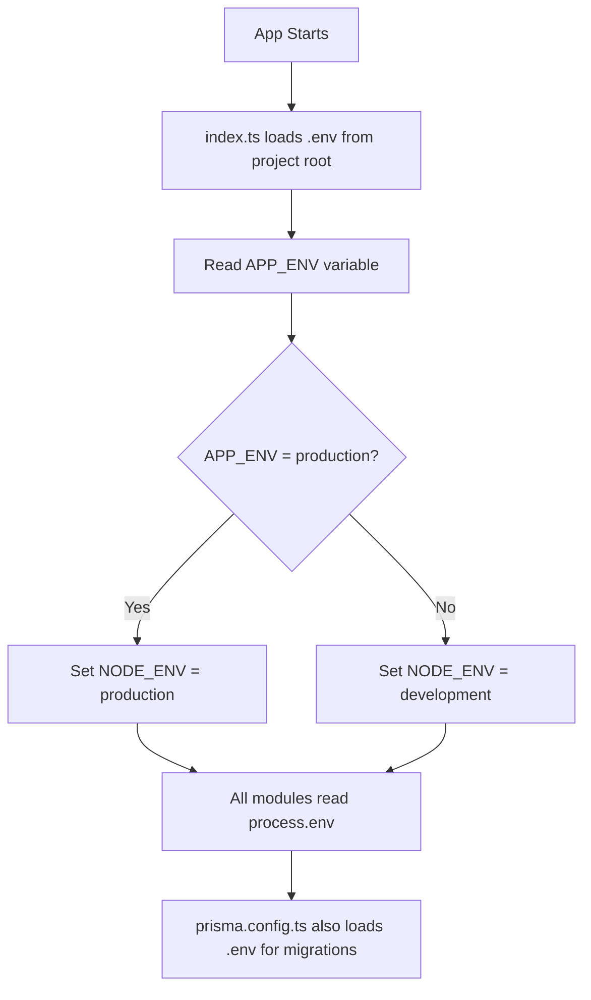

# Environment Configuration Refactor Plan

## Problem

Multiple dotenv loading points across the backend are causing env variable conflicts:

- [`backend/src/index.ts:10`](backend/src/index.ts:10): Chooses `.env` vs `.dev.env` based on `NODE_ENV`
- [`backend/prisma.config.ts:5`](backend/prisma.config.ts:5): Tries `../.env` and `./.env` independently
- [`backend/src/config/prisma.ts:2`](backend/src/config/prisma.ts:2): Calls `dotenv.config()` with no path
- Split env files (`.env.example` and `.dev.env.example`) cause duplication and confusion

## Solution

Use a **single `.env` file** at the project root with an `APP_ENV` variable to control dev/prod behavior.

### New `.env.example` Structure

```env
# Application environment
# Set to "development" for local dev, "production" for Docker/deployed
APP_ENV=development

# Server
PORT=4000

# Database
DATABASE_URL=file:./dev.db

# JWT
JWT_SECRET=change-me-to-a-strong-random-secret
JWT_EXPIRES_IN=7d

# Steam Store API
STEAM_API_CC=CA

# Scheduled price refresh (daily)
PRICE_REFRESH_HOUR=13
PRICE_REFRESH_MINUTE=30
PRICE_REFRESH_TIMEZONE=America/New_York
```

### Changes Required

#### 1. [`backend/src/index.ts`](backend/src/index.ts)

- Load dotenv ONCE from project root (single source of truth)
- Derive `NODE_ENV` from `APP_ENV` immediately after loading
- Remove `.dev.env` logic entirely

```ts
import dotenv from "dotenv";
import path from "path";
import { fileURLToPath } from "url";

const __filename = fileURLToPath(import.meta.url);
const __dirname = path.dirname(__filename);
const projectRoot = path.resolve(__dirname, "../..");

// Load env ONCE from project root
dotenv.config({ path: path.join(projectRoot, ".env") });

// Derive NODE_ENV from APP_ENV
const appEnv = process.env.APP_ENV ?? "development";
process.env.NODE_ENV = appEnv === "production" ? "production" : "development";

const isProduction = appEnv === "production";
```

#### 2. [`backend/prisma.config.ts`](backend/prisma.config.ts)

- Load from project root only (one path, not two attempts)

```ts
import { defineConfig } from "prisma/config";
import dotenv from "dotenv";
import path from "path";
import { fileURLToPath } from "url";

const __filename = fileURLToPath(import.meta.url);
const __dirname = path.dirname(__filename);
const projectRoot = path.resolve(__dirname, "..");

dotenv.config({ path: path.join(projectRoot, ".env") });

export default defineConfig({
  datasource: {
    url: process.env.DATABASE_URL ?? "file:./dev.db",
  },
});
```

#### 3. [`backend/src/config/prisma.ts`](backend/src/config/prisma.ts)

- Remove the `dotenv.config()` call entirely (env is already loaded by index.ts when running)
- Keep fallback for DATABASE_URL

```ts
import { PrismaClient } from "@prisma/client";
import { PrismaLibSql } from "@prisma/adapter-libsql";

const sqliteUrl = process.env.DATABASE_URL ?? "file:./dev.db";

const adapter = new PrismaLibSql({ url: sqliteUrl });

export const prisma = new PrismaClient({
  adapter,
  log: ["warn", "error"],
});

export default prisma;
```

#### 4. Delete `.dev.env.example`

No longer needed.

#### 5. [`docker-compose.yml`](docker-compose.yml)

- Change `NODE_ENV=production` to `APP_ENV=production`
- Backend will derive `NODE_ENV` from `APP_ENV`

```yaml
environment:
  - APP_ENV=production
  - PORT=4000
  - DATABASE_URL=file:/app/data/steam.db
  - JWT_SECRET=${JWT_SECRET:?JWT_SECRET must be set}
  - JWT_EXPIRES_IN=7d
  - STEAM_API_CC=${STEAM_API_CC:-USD}
```

#### 6. No Changes Needed

These files only read `process.env` and will work as-is:

- [`backend/src/utils/jwt.ts`](backend/src/utils/jwt.ts) - reads `JWT_SECRET`, `JWT_EXPIRES_IN`
- [`backend/src/services/steam.service.ts`](backend/src/services/steam.service.ts) - reads `STEAM_API_CC`
- [`backend/src/services/price-refresh-job.ts`](backend/src/services/price-refresh-job.ts) - reads `PRICE_REFRESH_*`
- [`backend/src/middleware/error.middleware.ts`](backend/src/middleware/error.middleware.ts) - reads `NODE_ENV` (now derived from `APP_ENV`)

## Flow Diagram



## Dev vs Prod Usage

### Development
- Copy `.env.example` to `.env`
- Keep `APP_ENV=development`
- Use SQLite with `DATABASE_URL=file:./dev.db`
- Run `npm run dev` in `/backend`

### Production (Docker)
- docker-compose.yml sets `APP_ENV=production`
- docker-compose.yml overrides `DATABASE_URL` to persistent volume
- `JWT_SECRET` required via `${JWT_SECRET:?...}`
- Backend derives `NODE_ENV=production` automatically

## Migration Steps for User

1. Back up existing `.env` and `.dev.env` files
2. Delete `.dev.env`
3. Copy new `.env.example` to `.env`
4. Fill in your actual `JWT_SECRET` and other production values
5. Set `APP_ENV=development` for local work
6. For Docker, update docker-compose.yml per plan above
