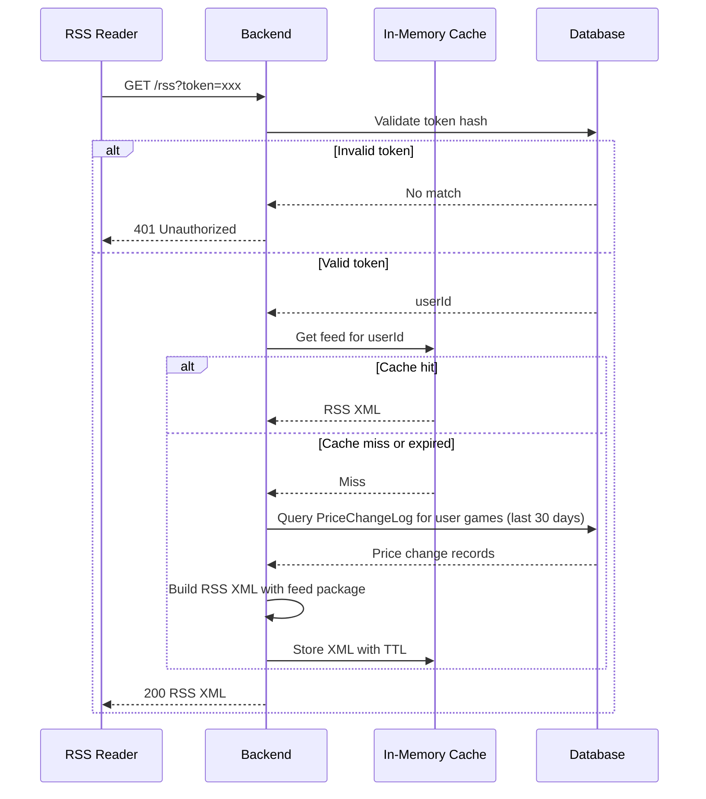

# RSS Feed Feature Plan

## Goal

Provide per-user RSS feeds that report price changes across all their wishlists, so users can subscribe with external RSS readers and get notified of sales without polling.

## Design Decisions

- One feed per user, aggregating all price changes across all their wishlists.
- Auth via single-use-style RSS token passed as query parameter.
- Feed generated on each request, backed by a short-lived in-memory cache.
- HTTP caching headers used as an additional optimization.
- Uses a lightweight `PriceChangeLog` model as a short-lived notification changelog (not permanent history).

## Components

### 1. Database Schema Changes

- Add `PriceChangeLog` model:
  - Purpose: Short-lived notification log, not permanent price history. Entries are auto-deleted after 30 days.
  - Fields: `id`, `gameId` (FK), `oldPrice`, `newPrice`, `oldDiscount`, `newDiscount`, `timestamp`.
  - Indexed on `(gameId, timestamp)` and `(timestamp)` for fast queries and cleanup.
- Add `rssTokenHash` field to `User` model:
  - Stores a one-way hash of the user's RSS token.
  - Nullable (users without an RSS feed won't have one).

### 2. Price Change Log Integration

- Modify the price refresh logic (`game.service.ts` / `price-refresh-job.ts`):
  - Before updating a game's price, compare with the previous stored price.
  - If the price or discount changed, insert a `PriceChangeLog` record.
  - Then update the `Game` row as normal.
- Add a cleanup step (can run with the same daily job): delete `PriceChangeLog` entries older than 30 days.
- No other service changes required; the price refresh job becomes the source of truth for price changes.

### 3. RSS Token Management

- Add an endpoint to generate/regenerate a user's RSS token:
  - Only accessible by authenticated users (via existing JWT auth).
  - Generates a random token, hashes it, and stores the hash in `User.rssTokenHash`.
  - Returns the plaintext token once (or provides it in the UI).
- Old tokens are invalidated when a new one is generated (hash is overwritten).

### 4. RSS Feed Endpoint

- New public endpoint (no JWT required): `/rss?token=<rss_token>`.
- Flow:
  1. Validate the token by hashing it and matching against `User.rssTokenHash`.
  2. Fetch all `PriceChangeLog` entries for games belonging to that user's wishlists.
  3. Limit to last N changes (e.g., 50) and only entries from the last 30 days.
  4. Generate RSS XML using the `feed` package.
  5. Return with appropriate headers (`Content-Type: application/rss+xml`, `Cache-Control: max-age=300`).

### 5. In-Memory Cache

- Simple in-memory cache keyed by `userId`:
  - Value: pre-generated RSS XML string.
  - TTL: 5 minutes (300 seconds).
- On each `/rss` request:
  - If cache hit and not expired → return cached XML.
  - Otherwise → generate fresh feed, store in cache, return.
- Invalidation strategy:
  - Time-based only (TTL). Do not try to invalidate on every price refresh; the TTL is short enough.
- No persistence across restarts; a cold start just means one extra generation per user.

### 6. Feed Content

Each RSS item will include:
- Title: Game name with price change summary (e.g. "Game Name: $60 → $30 (-50%)").
- Link: Steam store URL for the game.
- PubDate: Timestamp of the price change.
- Description: Short summary including old price, new price, discount, and wishlist name.

Feed metadata:
- Title: "Price updates for [username]'s Steam wishlists" (or similar, without exposing sensitive info).
- Link: Back to the app dashboard for that user.
- Description: Static description of the feed.

## High-Level Flow

## Implementation Order

1. Add `PriceChangeLog` model and migrate.
2. Wire price change logging into the existing price refresh flow.
3. Add cleanup of old `PriceChangeLog` entries to the daily job.
3. Add `rssTokenHash` to `User` model and migrate.
4. Implement RSS token generation/rotation endpoint.
5. Implement the RSS feed generation logic.
6. Add the in-memory cache layer.
7. Add the `/rss` route with auth and caching headers.
8. (Optional) Add UI for users to view and regenerate their RSS feed URL.

## Open Questions / Notes

- This is not redundant with SteamDB because:
  - It's a bounded 30-day window, not permanent history.
  - It's optimized for our specific use case (per-user wishlist changes).
- Should the feed include non-discount price increases? Probably yes, but it could be configurable later.
- Username in feed title could be considered semi-sensitive; alternatively, use a generic title like "My Steam Wishlist Price Updates".
- Rate limiting on `/rss` could be considered if abuse is a concern, but RSS readers typically poll infrequently.
