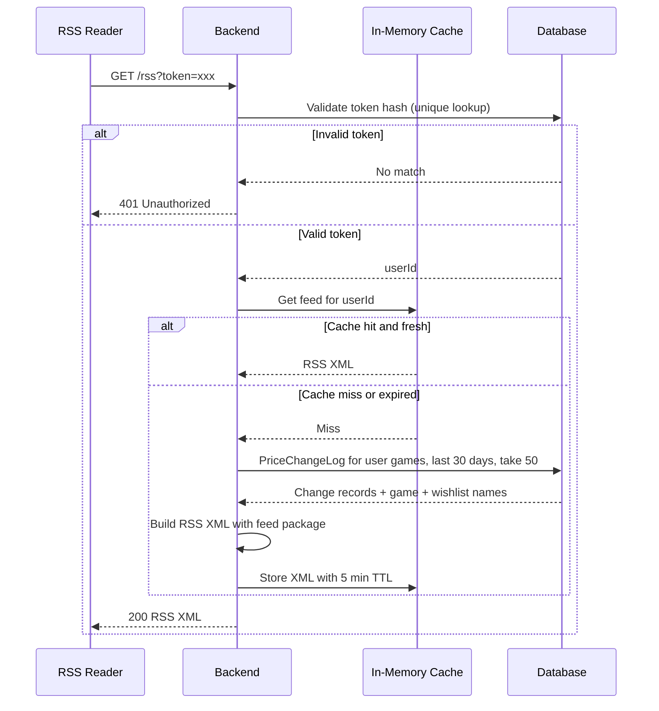

# RSS Feed Feature Plan

## Goal

Provide per-user RSS feeds that report price changes across all their wishlists, so users can subscribe with external RSS readers and get notified of sales without polling.

## Design Decisions

- One feed per user, aggregating all price changes across all their wishlists.
- Auth via an opaque RSS token passed as a query parameter; only a SHA-256 hash is stored server-side.
- Feed generated on each request, backed by a short-lived in-memory cache.
- HTTP caching headers used as an additional optimization.
- Uses a lightweight `PriceChangeLog` model as a short-lived notification changelog (not permanent history); entries are auto-deleted after 30 days.
- **All** price-update paths log changes (daily job + manual per-wishlist/per-user refresh + fetch-on-add), so the feed never misses a change a user can see in the UI.
- One feed item per price-change event (per game); the user's wishlist names are listed in the item description.
- Feed title is generic ("Steam Wishlist Price Updates") — no username, avoids exposing semi-sensitive info.

## Components

### 1. Database Schema Changes (Prisma, SQLite)

- Add `PriceChangeLog` model:
  - Purpose: short-lived notification log, not permanent price history. Entries are auto-deleted after 30 days.
  - Fields: `id` (uuid), `gameId` (Int, FK → `Game.steamId`, `onDelete: Cascade`), `oldPrice` (Decimal?), `newPrice` (Decimal?), `oldDiscount` (Int?), `newDiscount` (Int?), `timestamp` (DateTime, default now).
  - Indexed on `(gameId, timestamp)` and `(timestamp)` (the latter drives the cleanup query).
- Add `rssTokenHash String? @unique` to `User`:
  - One-way SHA-256 hash of the user's RSS token.
  - `@unique` so token validation is a single indexed lookup.
  - Nullable (users without an RSS feed won't have one).
- Migration: one `prisma migrate dev` adding the table + column.

### 2. Price Change Log Integration

**Key codebase fact:** price updates happen in **four** places in `game.service.ts`, not one:

1. `addGameToWishlist` — upsert on add (a fresh fetch can change a shared `Game` row).
2. `refreshGamesInWishlist` — manual per-wishlist refresh.
3. `refreshAllUserGames` — manual per-user refresh.
4. `refreshAllGames` — daily scheduled job (`price-refresh-job.ts`).

Plan:

- Add a shared helper, e.g. `saveGameWithPriceLog(steamId, data)`:
  1. Read the current `Game` row.
  2. Compare `currentPrice` / `discountPercent` (use `Decimal.toNumber()` for comparison).
  3. If either changed → insert a `PriceChangeLog` row **in the same Prisma transaction** as the `Game` update.
  4. Update the `Game` row.
- Replace the inline `prisma.game.update` calls in all four paths with the helper (eliminates the duplicated update loops).
- Add a cleanup step to the daily job: `priceChangeLog.deleteMany({ where: { timestamp: { lt: thirtyDaysAgo } } })`.
- Note (pre-existing quirk, out of scope): refresh paths never set `priceUpdatedAt`; staleness is based on `Game.updatedAt`.

### 3. RSS Token Management

- New endpoint `POST /api/rss/token` (JWT auth via the existing `authenticate` middleware):
  - Generates `crypto.randomBytes(32).toString('hex')` (64-char opaque token — high entropy, so plain SHA-256 storage is safe; no HMAC/salt needed).
  - Stores `sha256(token)` in `User.rssTokenHash` (overwritten on rotation → old token invalidated).
  - Returns the plaintext token **once**: `{ token, feedUrl }` where `feedUrl` is the full `/rss?token=...` URL for the UI to display/copy.
- No separate "delete feed" endpoint; regeneration is rotation.

### 4. RSS Feed Endpoint

- New public endpoint: `GET /rss?token=<rss_token>` (no JWT).
- **Route ordering:** must be registered in `index.ts` **before** the production SPA fallback (`app.get(/(.*)/)`), or the fallback swallows the route in production.
- Flow:
  1. Validate token: `user.findUnique({ where: { rssTokenHash: sha256(token) } })` → `401` if missing/invalid.
  2. Check in-memory cache for `userId` → return cached XML if fresh.
  3. Otherwise query feed data and build XML (below), store in cache, return.
- Query (single Prisma call; nested includes avoid row multiplication):
  - `priceChangeLog.findMany` where `timestamp >= now - 30d` and the game has at least one `wishlistGame` in a wishlist owned by the user; include `game` plus that user's `wishlistGames.wishlist`; `orderBy: { timestamp: 'desc' }`, `take: 50`.
- Headers: `Content-Type: application/rss+xml; charset=utf-8`, `Cache-Control: max-age=300`.

### 5. In-Memory Cache

- `Map<userId, { xml: string; expiresAt: number }>` in a small module (e.g. `src/services/rss-cache.ts`).
- TTL: 5 minutes (300 s), time-based only.
- Size cap: ~500 entries max; evict expired entries on insert, then oldest-expiring if still over cap (prevents unbounded growth in a long-lived process).
- No persistence; a cold start just means one extra generation per user.
- No invalidation needed on token rotation (keyed by `userId`; feed content is unaffected).

### 6. Feed Content

Each item (one per `PriceChangeLog` row):

- Title: `Game Name: $60.00 → $30.00 (-50%)` — format with the game's `currency`, not a hardcoded `$`.
- Link: `https://store.steampowered.com/app/<steamId>/`.
- PubDate: the change `timestamp`.
- Description: e.g. "Dropped from $60.00 to $30.00 (50% off). In your wishlists: Wishlist A, Wishlist B."

Feed metadata:

- Title: `Steam Wishlist Price Updates` (generic).
- Link: app dashboard URL (env `APP_URL`, default `http://localhost:5173`).
- Description: static text.
- Generated with the `feed` package (add `feed` + `@types/feed` to backend deps — neither is currently installed).

## High-Level Flow



## Task List (for incremental LLM implementation)

Each task below is self-contained: it includes the context an implementer needs, the files to touch, concrete steps, and a verifiable definition of done. Tasks are ordered by dependency. Pick up **one at a time**; each task leaves the codebase in a working state (no broken build) when finished.

> Conventions: run backend commands from `backend/`. Type-check with `npx tsc --noEmit`. "Done" means the definition-of-done checks pass.

### Task 1 — Database schema: `PriceChangeLog` + `User.rssTokenHash` DONE.

- **Depends on:** none
- **Files:** `backend/prisma/schema.prisma` (+ generated migration)
- **Context:** Prisma + SQLite. `Game`'s primary key is `steamId Int`. `User` is the first model in the schema.
- **Steps:**
  1. Add the `PriceChangeLog` model:
     ```prisma
     model PriceChangeLog {
       id          String   @id @default(uuid())
       gameId      Int
       game        Game     @relation(fields: [gameId], references: [steamId], onDelete: Cascade)
       oldPrice    Decimal?
       newPrice    Decimal?
       oldDiscount Int?
       newDiscount Int?
       timestamp   DateTime @default(now())

       @@index([gameId, timestamp])
       @@index([timestamp])
     }
     ```
  2. Add a `priceChangeLogs PriceChangeLog[]` relation field to the `Game` model (required by the FK above).
  3. Add `rssTokenHash String? @unique` to the `User` model.
  4. Run `npx prisma migrate dev --name add_price_change_log_and_rss_token`.
- **Definition of done:**
  - Migration applies with no errors; `npx prisma generate` succeeds.
  - The generated client exposes `priceChangeLog` and `User.rssTokenHash`.

### Task 2 — Add `feed` dependency DONE

- **Depends on:** none (can run in parallel with Task 1)
- **Files:** `backend/package.json`
- **Steps:**
  1. From `backend/`: `npm install feed` and `npm install -D @types/feed`.
- **Definition of done:**
  - `feed` is in `dependencies`, `@types/feed` in `devDependencies`.
  - A scratch file containing `import Feed from 'feed';` passes `npx tsc --noEmit`.

### Task 3 — Price-change logging helper + wire into all update paths DONE

- **Depends on:** Task 1
- **Files:** `backend/src/services/game.service.ts`
- **Context:** Price writes currently happen in **four** places, each doing an inline `prisma.game.update`/`upsert`: `addGameToWishlist` (~line 100), `refreshGamesInWishlist` (~line 328), `refreshAllUserGames` (~line 391), `refreshAllGames` (~line 437).
- **Steps:**
  1. Add a helper `saveGameWithPriceLog(steamId, data)` where `data` = `{ name, currentPrice, originalPrice, discountPercent, currency, imageUrl }`:
     - Read the current `Game` row (`prisma.game.findUnique`).
     - If the row exists and `(currentPrice, discountPercent)` changed (compare via `Decimal.toNumber()`, treating `null` as a distinct value) → insert a `PriceChangeLog` row **and** update the `Game` row inside one `prisma.$transaction`.
     - If the row does not exist → create the `Game` row (no log entry for a brand-new game).
     - If nothing changed → update only mutable fields (name/image/currency), skip the log.
  2. Replace the inline price writes in all four functions with `saveGameWithPriceLog`.
- **Definition of done:**
  - All four functions call the helper (no remaining inline price writes).
  - A refresh that changes price/discount creates exactly one `PriceChangeLog` row; no change creates none.
  - `npx tsc --noEmit` passes.

### Task 4 — Cleanup of old `PriceChangeLog` entries

- **Depends on:** Task 1
- **Files:** `backend/src/services/price-refresh-job.ts`
- **Steps:**
  1. In the daily job callback, after `refreshAllGames()` resolves, run:
     `prisma.priceChangeLog.deleteMany({ where: { timestamp: { lt: new Date(Date.now() - 30 * 24 * 60 * 60 * 1000) } } })`.
  2. Log the number of deleted rows.
- **Definition of done:**
  - The daily job deletes `PriceChangeLog` rows older than 30 days and still logs refresh results as before.

### Task 5 — In-memory TTL cache module

- **Depends on:** none
- **Files:** new `backend/src/services/rss-cache.ts`
- **Steps:**
  1. Export a cache keyed by `userId` holding `{ xml: string; expiresAt: number }`.
  2. `get(userId)` → returns the XML if not expired, else `undefined`.
  3. `set(userId, xml)` → stores with `expiresAt = Date.now() + 300_000`.
  4. Enforce a cap (~500 entries): on `set`, first evict expired entries; if still over cap, evict the entry with the earliest `expiresAt`.
- **Definition of done:**
  - `get` returns fresh values within the TTL and `undefined` after expiry.
  - The map never exceeds the cap. `npx tsc --noEmit` passes.

### Task 6 — RSS service: token + feed generation

- **Depends on:** Tasks 1, 2, 5
- **Files:** new `backend/src/services/rss.service.ts`
- **Steps:**
  1. `generateToken(userId)`: create `crypto.randomBytes(32).toString('hex')`, store `sha256(token)` in `User.rssTokenHash`, return `{ token, feedUrl }`.
  2. `validateToken(token)`: return the user if `sha256(token)` matches a `User.rssTokenHash`, else `null`.
  3. `buildFeedXml(userId)`:
     - Query `priceChangeLog.findMany` for the last 30 days, `take: 50`, `orderBy: { timestamp: 'desc' }`, filtered to games in this user's wishlists, including `game` and the user's `wishlistGames.wishlist`.
     - Build items: title `Name: $old → $new (-X%)` (use the game's `currency`), link `https://store.steampowered.com/app/<steamId>/`, pubDate = timestamp, description = old/new price + discount + wishlist names.
     - Use the `feed` package; feed title `Steam Wishlist Price Updates`, link = env `APP_URL` (default `http://localhost:5173`), static description.
     - Use the Task 5 cache: `get` → build → `set`.
- **Definition of done:**
  - `generateToken` returns a working token; the previous token is invalidated after rotation.
  - `validateToken` returns the correct user / `null`.
  - `buildFeedXml` returns valid RSS XML containing the expected items. `npx tsc --noEmit` passes.

### Task 7 — Routes and wiring

- **Depends on:** Task 6
- **Files:** new `backend/src/controllers/rss.controller.ts`, new `backend/src/routes/rss.routes.ts`, `backend/src/index.ts`
- **Steps:**
  1. Create `rss.routes.ts`:
     - `POST /token` → `authenticate` middleware → `generateToken` (returns `{ token, feedUrl }`).
     - `GET /rss` → public → read `req.query.token`, `validateToken`; if invalid return 401, else `buildFeedXml`, set `Content-Type: application/rss+xml; charset=utf-8` and `Cache-Control: max-age=300`, send the XML.
  2. In `index.ts`: mount `app.use('/api/rss', rssRoutes)` and register the public `/rss` route **before** the production SPA fallback block.
- **Definition of done:**
  - `POST /api/rss/token` with a JWT returns a token; without a JWT returns 401.
  - `GET /rss?token=...` returns 200 RSS XML; a bad token returns 401.
  - In production mode, `/rss` is not swallowed by the SPA fallback. `npx tsc --noEmit` passes.

### Task 8 — Frontend UI

- **Depends on:** Task 7
- **Files:** `frontend/src/features/dashboard/DashboardPage.tsx` (or a new component), `frontend/src/app/services/api.ts` (or a new `rssApi.ts`)
- **Steps:**
  1. Add an API helper for `POST /api/rss/token`.
  2. Add a dashboard section/dialog: "Show feed URL" (calls the endpoint, displays the URL with a copy button) and "Regenerate token".
  3. Show a note that the token is only displayed once.
- **Definition of done:**
  - An authenticated user can view and copy the feed URL from the dashboard.
  - Regenerating produces a new URL and invalidates the old one.
  - `npm run build` (frontend) passes.

### Task 9 — End-to-end verification

- **Depends on:** Tasks 1–8
- **Files:** none (verification only)
- **Steps:** Run the **Verification Checklist** section above and confirm every item passes.
- **Definition of done:** All checklist items pass.

## Verification Checklist

- `prisma migrate dev` applies cleanly; `prisma generate` succeeds.
- Add a game, trigger a refresh where the price/discount changes → `PriceChangeLog` row exists; unchanged price → no row.
- `POST /api/rss/token` returns a token; `GET /rss?token=...` returns valid RSS XML containing the change.
- Second request within 5 minutes is served from cache.
- Bad token → 401; after regeneration, old token → 401.
- Game in two of the user's wishlists → one feed item listing both wishlist names.
- Production mode: `/rss` still resolves (not swallowed by the SPA fallback).

## Open Questions / Notes

- Not redundant with SteamDB: bounded 30-day window, per-user wishlist scope, optimized for this use case.
- Price increases are included (feed reports any change); could be made configurable later.
- No rate limiting for now; RSS readers poll infrequently. Revisit if abuse appears.
- The `priceUpdatedAt` staleness quirk is out of scope for this feature.
