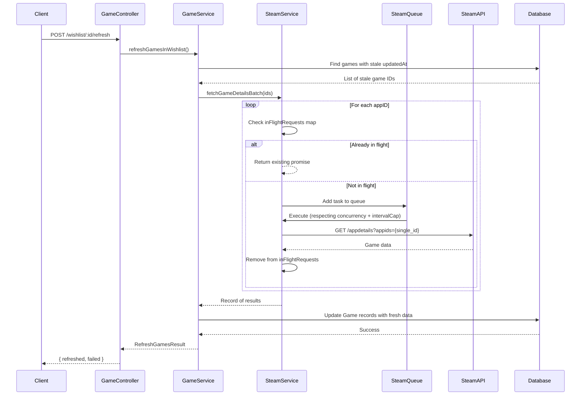

# Steam API Rate Limiting Implementation Plan

## Problem

As identified in [Issue #9](https://github.com/TimothyLai77/steam-wishlist/issues/9):

1. **Steam API does not support true batching**: The current [`fetchGameDetailsBatch()`](backend/src/services/steam.service.ts:42) function sends comma-separated appIDs (e.g., `?appids=123,456,789`), but Steam processes each appID individually on their end. Each appID in a "batch" request still counts toward the rate limit.
2. **Rate limit**: Steam enforces 200 requests / 5 minutes. We should stay safely below this at ~150 requests / 5 minutes.
3. **No rate limiting**: Current code makes all requests as fast as possible with no throttling.
4. **No staleness checks**: Refresh functions fetch data for ALL games regardless of whether they were recently refreshed.
5. **No in-flight deduplication**: If the same appID is requested concurrently (e.g., refresh on two wishlists containing the same game), both requests fire.

## Prerequisites (Already Complete)

- Database schema refactor is complete (commit 11f7776): Global `Game` table with `steamId` as PK ensures each game is stored once regardless of how many wishlists contain it.
- `Game` model has `updatedAt` field (auto-updated by Prisma) that can be used for staleness checks.

## Solution Overview

Use the [`p-queue`](https://github.com/sindresorhus/p-queue) library as a singleton queue to:
1. Queue individual API requests (one per appID)
2. Limit concurrency to 3 simultaneous requests
3. Cap total requests at 150 per 5-minute interval

Additional mechanisms:
- **In-flight tracking map**: Prevents duplicate requests for the same appID while a request is already pending.
- **Staleness check using `updatedAt`**: Skip games where `updatedAt` is within the last configured threshold (via environment variable).

## Implementation Steps

### Step 1: Add p-queue dependency DONE

DONE, should already be installed in /backend

### Step 2: Update .env with staleness threshold DONE

Add a new environment variable to [`.env`](.env) and [`.env.example`](.env.example) for configuring how long game data is considered fresh:

```env
# How long (in hours) before game data is considered stale and eligible for refresh
# Default: 3 hours
STEAM_GAME_STALE_HOURS=3
```

### Step 3: Create singleton PQueue instance in lib/steamQueue.ts

Create a new file [`backend/src/lib/steamQueue.ts`](backend/src/lib/steamQueue.ts):

```typescript
import PQueue from 'p-queue';

/**
 * Singleton queue for all Steam API requests.
 * - concurrency: 3 simultaneous requests max
 * - intervalCap: 150 requests per 5-minute window (below Steam's 200 limit)
 */
export const steamQueue = new PQueue({
  concurrency: 3,
  intervalCap: 150,
  interval: 5 * 60_000,
});
```

**Rationale:**
- Kept generic and separate from business logic (knows nothing about games/DB).
- Exported as a singleton so all imports share the same queue instance.

### Step 4: Create in-flight tracking map and rewrite steam.service.ts

Rewrite [`steam.service.ts`](backend/src/services/steam.service.ts) with:
1. Import the singleton `steamQueue`
2. Add an in-flight tracking map (`Map<string, Promise<SteamGameDetails | null>>`)
3. Individual per-appID requests through PQueue with deduplication

**New structure:**

```typescript
import { steamQueue } from '../lib/steamQueue.js';

export interface SteamGameDetails {
  success: boolean;
  name: string;
  currentPrice: number;
  originalPrice: number | null;
  discountPercent: number;
  currency: string;
  imageUrl: string;
}

interface SteamApiResponse {
  [appId: string]: {
    success: boolean;
    data?: {
      name: string;
      is_free: boolean;
      tiny_image: string;
      price_overview?: {
        currency: string;
        initial: number;
        final: number;
        discount_percent: number;
      };
    };
  };
}

const STEAM_STORE_BASE_URL = 'https://store.steampowered.com/api/appdetails';
const STEAM_API_CC = process.env.STEAM_API_CC ?? 'US';

/**
 * Tracks in-flight requests for each appID to avoid duplicate concurrent requests.
 */
const inFlightRequests = new Map<string, Promise<SteamGameDetails | null>>();

const fetchSingleGameDetails = async (steamId: string): Promise<SteamGameDetails | null> => {
  try {
    const url = `${STEAM_STORE_BASE_URL}?appids=${steamId}&cc=${STEAM_API_CC}`;
    const response = await fetch(url);

    if (!response.ok) {
      console.error(`Steam Store API error for ${steamId}: ${response.status} ${response.statusText}`);
      return null;
    }

    const data = (await response.json()) as Record<string, { success: boolean; data?: SteamApiResponse[string][string]['data'] }>;
    const appData = data[steamId];

    if (!appData?.success || !appData.data) {
      console.error(`Game ${steamId} not found or Steam API returned error`);
      return null;
    }

    const { name, tiny_image, price_overview } = appData.data;

    let currentPrice = 0;
    let originalPrice: number | null = null;
    let discountPercent = 0;
    let currency = 'USD';

    if (price_overview) {
      currentPrice = price_overview.final / 100;
      discountPercent = price_overview.discount_percent || 0;
      currency = price_overview.currency || 'USD';

      if (discountPercent > 0) {
        originalPrice = price_overview.initial / 100;
      }
    }

    return {
      success: true,
      name: name || 'Unknown Game',
      currentPrice,
      originalPrice,
      discountPercent,
      currency,
      imageUrl: tiny_image || '',
    };
  } catch (error) {
    console.error(`Failed to fetch game details for ${steamId}:`, error);
    return null;
  }fetchGameDetails
};

/**
 * Fetch a single game's details, respecting rate limits and in-flight deduplication.
 */
export const fetchGameDetails = async (
  steamId: string,
): Promise<SteamGameDetails | null> => {
  // Return existing in-flight promise if one is already pending
  if (inFlightRequests.has(steamId)) {
    return inFlightRequests.get(steamId)!;
  }

  const promise = steamQueue.add(() => fetchSingleGameDetails(steamId));

  // Track in-flight request
  inFlightRequests.set(steamId, promise);

  try {
    const result = await promise;
    return result;
  } finally {
    // Clean up in-flight tracking after completion
    inFlightRequests.delete(steamId);
  }
};

/**
 * Fetch details for multiple games. Each appID is an individual queued request.
 * Uses in-flight deduplication so concurrent callers share the same request.
 */
export const fetchGameDetailsBatch = async (
  steamIds: string[],
): Promise<Record<string, SteamGameDetails | null>> => {
  const results: Record<string, SteamGameDetails | null> = {};

  const tasks = steamIds.map((id) =>
    fetchGameDetails(id).then((result) => ({ id, result }))
  );

  const completed = await Promise.all(tasks);
  for (const { id, result } of completed) {
    results[id] = result;
  }

  return results;
};
```

**Key design decisions:**
- `inFlightRequests` map is module-level (singleton scope).
- `fetchGameDetails()` checks the map first; if a request for that appID is already pending, it returns the same promise.
- `fetchGameDetailsBatch()` calls `fetchGameDetails()` for each ID (benefiting from deduplication).
- In-flight entries are cleaned up in the `finally` block to prevent memory leaks.

### Step 5: Add staleness check using Game.updatedAt to refresh functions

In [`game.service.ts`](backend/src/services/game.service.ts), modify the refresh functions to only fetch games where `updatedAt` is older than the configured threshold (from `STEAM_GAME_STALE_HOURS` env var).

**Define the staleness threshold at the top of game.service.ts:**

```typescript
// How long (in hours) before game data is considered stale (from env, default 3 hours)
const STALE_THRESHOLD_HOURS = parseInt(process.env.STEAM_GAME_STALE_HOURS ?? '3', 10);
const STALE_THRESHOLD_MS = STALE_THRESHOLD_HOURS * 60 * 60 * 1000;
```

**Update [`refreshGamesInWishlist()`](backend/src/services/game.service.ts:273):**

```typescript
export const refreshGamesInWishlist = async (
  wishlistId: string,
  userId: string,
): Promise<RefreshGamesResult> => {
  const wishlist = await prisma.wishlist.findFirst({
    where: { id: wishlistId, userId },
  });

  if (!wishlist) {
    throw new Error('Wishlist not found');
  }

  const staleThreshold = new Date(Date.now() - STALE_THRESHOLD_MS);

  // Get games in this wishlist that need refreshing (stale based on Game.updatedAt)
  const wishlistGames = await prisma.wishlistGame.findMany({
    where: { wishlistId },
    select: { gameId: true },
  });

  if (wishlistGames.length === 0) {
    return { refreshed: 0, failed: 0 };
  }

  const uniqueGameIds = [...new Set(wishlistGames.map((wg) => wg.gameId))];

  // Filter to only games that need refreshing based on Game.updatedAt
  const staleGames = await prisma.game.findMany({
    where: {
      steamId: { in: uniqueGameIds },
      OR: [
        { updatedAt: { lt: staleThreshold } },
        { updatedAt: null },
      ],
    },
    select: { steamId: true },
  });

  if (staleGames.length === 0) {
    return { refreshed: 0, failed: 0 };
  }

  const staleGameIds = staleGames.map((g) => g.steamId);
  const steamIds = staleGameIds.map((id) => String(id));
  const steamData = await fetchGameDetailsBatch(steamIds);

  let refreshed = 0;
  let failed = 0;

  for (const gameId of staleGameIds) {
    const id = String(gameId);
    const data = steamData[id];

    if (data) {
      await prisma.game.update({
        where: { steamId: gameId },
        data: {
          name: data.name,
          currentPrice: data.currentPrice,
          originalPrice: data.originalPrice,
          discountPercent: data.discountPercent,
          currency: data.currency,
          imageUrl: data.imageUrl,
        },
      });
      refreshed++;
    } else {
      failed++;
    }
  }

  return { refreshed, failed };
};
```

**Apply the same pattern to [`refreshAllUserGames()`](backend/src/services/game.service.ts:327):**

```typescript
export const refreshAllUserGames = async (
  userId: string,
): Promise<RefreshGamesResult> => {
  const wishlistGames = await prisma.wishlistGame.findMany({
    where: {
      wishlist: { userId },
    },
    select: { gameId: true },
  });

  const uniqueGameIds = [...new Set(wishlistGames.map((wg) => wg.gameId))];

  if (uniqueGameIds.length === 0) {
    return { refreshed: 0, failed: 0 };
  }

  const staleThreshold = new Date(Date.now() - STALE_THRESHOLD_MS);

  // Filter to only games that need refreshing
  const staleGames = await prisma.game.findMany({
    where: {
      steamId: { in: uniqueGameIds },
      OR: [
        { updatedAt: { lt: staleThreshold } },
        { updatedAt: null },
      ],
    },
    select: { steamId: true },
  });

  if (staleGames.length === 0) {
    return { refreshed: 0, failed: 0 };
  }

  const staleGameIds = staleGames.map((g) => g.steamId);
  const steamIds = staleGameIds.map((id) => String(id));
  const steamData = await fetchGameDetailsBatch(steamIds);

  let refreshed = 0;
  let failed = 0;

  for (const gameId of staleGameIds) {
    const id = String(gameId);
    const data = steamData[id];

    if (data) {
      await prisma.game.update({
        where: { steamId: gameId },
        data: {
          name: data.name,
          currentPrice: data.currentPrice,
          originalPrice: data.originalPrice,
          discountPercent: data.discountPercent,
          currency: data.currency,
          imageUrl: data.imageUrl,
        },
      });
      refreshed++;
    } else {
      failed++;
    }
  }

  return { refreshed, failed };
};
```

**Update [`refreshAllGames()`](backend/src/services/game.service.ts:375):**

Apply the same staleness threshold using `updatedAt`:

```typescript
export const refreshAllGames = async (): Promise<RefreshGamesResult> => {
  const staleThreshold = new Date(Date.now() - STALE_THRESHOLD_MS);

  const staleGames = await prisma.game.findMany({
    where: {
      OR: [
        { updatedAt: { lt: staleThreshold } },
        { updatedAt: null },
      ],
    },
    select: { steamId: true },
  });

  if (staleGames.length === 0) {
    return { refreshed: 0, failed: 0 };
  }

  const staleGameIds = staleGames.map((g) => g.steamId);
  const steamIds = staleGameIds.map((id) => String(id));
  const steamData = await fetchGameDetailsBatch(steamIds);

  let refreshed = 0;
  let failed = 0;

  for (const game of staleGames) {
    const id = String(game.steamId);
    const data = steamData[id];

    if (data) {
      await prisma.game.update({
        where: { steamId: game.steamId },
        data: {
          name: data.name,
          currentPrice: data.currentPrice,
          originalPrice: data.originalPrice,
          discountPercent: data.discountPercent,
          currency: data.currency,
          imageUrl: data.imageUrl,
        },
      });
      refreshed++;
    } else {
      failed++;
    }
  }

  return { refreshed, failed };
};
```

### Step 6: Update imports in game.service.ts

Update the import statement in [`game.service.ts`](backend/src/services/game.service.ts) to use the new paths:

```typescript
import { prisma } from '../config/prisma.js';
import { fetchGameDetails, fetchGameDetailsBatch } from './steam.service.js';
```

(No change needed if paths remain the same.)

## Architecture Diagram



## Flow: How a refresh request is handled

1. User clicks "Refresh" on a wishlist
2. [`refreshGamesInWishlist()`](backend/src/services/game.service.ts:273) queries `WishlistGame` for all game IDs in that wishlist
3. Filters to only games where `Game.updatedAt` is older than the configured threshold from `STEAM_GAME_STALE_HOURS`
4. Calls [`fetchGameDetailsBatch()`](backend/src/services/steam.service.ts) with the stale game IDs
5. For each appID:
   - Check `inFlightRequests` map - if already pending, reuse the existing promise
   - Otherwise, submit to `steamQueue` which respects concurrency (3) and intervalCap (150/5min)
6. Update `Game` records with fresh data (Prisma auto-updates `updatedAt`)
7. Return count of refreshed/failed games

## Expected Behavior

| Scenario | Before | After |
|----------|--------|-------|
| Refresh 50-game wishlist | 5 batch requests (50 appIDs), all counted individually by Steam, no rate limiting | Up to 50 individual requests, queued with max 3 concurrent, capped at 150/5min |
| Refresh same wishlist twice within stale threshold | Both refreshes fetch all 50 games | Second refresh returns immediately (0 refreshed, all games are fresh) |
| Refresh two wishlists with overlapping games | Same game fetched twice | In-flight dedup: second request waits for first |
| Add game to wishlist | Single batch call with 1 appID | Single queued call (still rate-limited) |
| Scheduled refresh job | Fetches all games regardless of staleness | Only fetches games with stale `updatedAt` |

## Configuration

| Variable | Description | Default |
|----------|-------------|---------|
| `STEAM_GAME_STALE_HOURS` | Hours before game data is considered stale | `3` |
| `STEAM_API_CC` | Country code for pricing | `US` |

## Notes

- The `steamQueue` is exported from [`lib/steamQueue.ts`](backend/src/lib/steamQueue.ts) so it can be monitored or awaited for completion if needed (e.g., graceful shutdown).
- PQueue tasks will wait if the interval cap is reached, rather than failing. This prevents rate limit errors.
- The staleness threshold is configurable via `STEAM_GAME_STALE_HOURS` environment variable.
- Frontend changes (toast messaging for async refresh) are out of scope for this plan but noted in Issue #9.
- The `inFlightRequests` map is intentionally not persisted; it only prevents concurrent duplicates within the same process lifetime.
